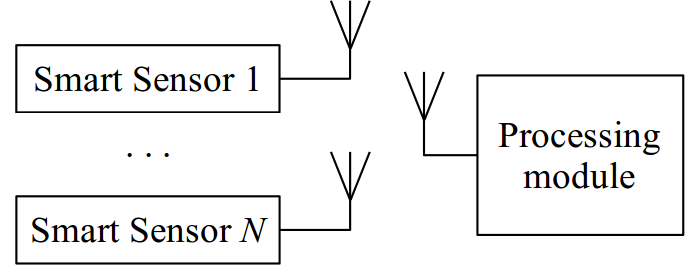
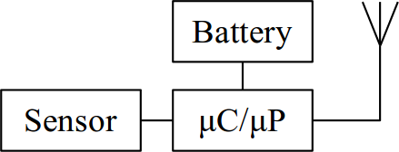
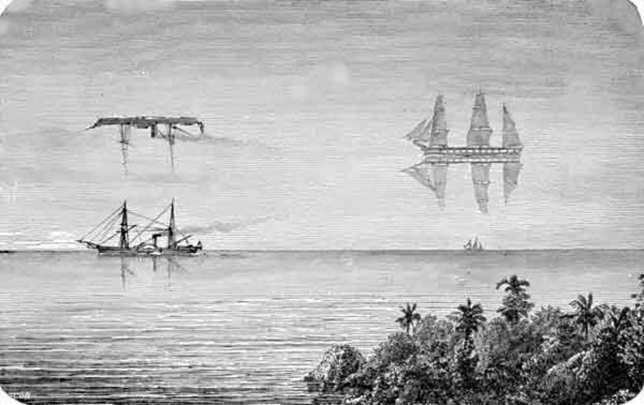
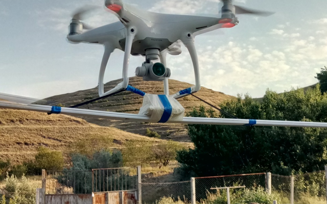
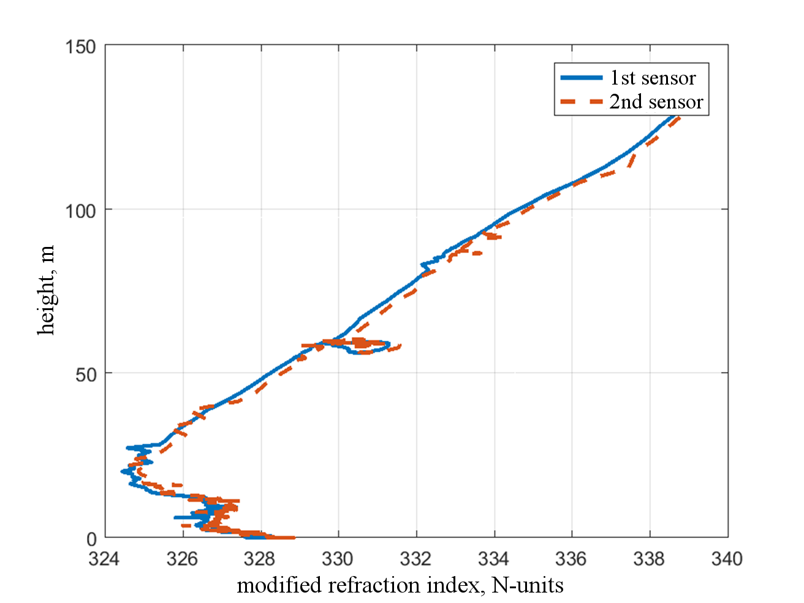
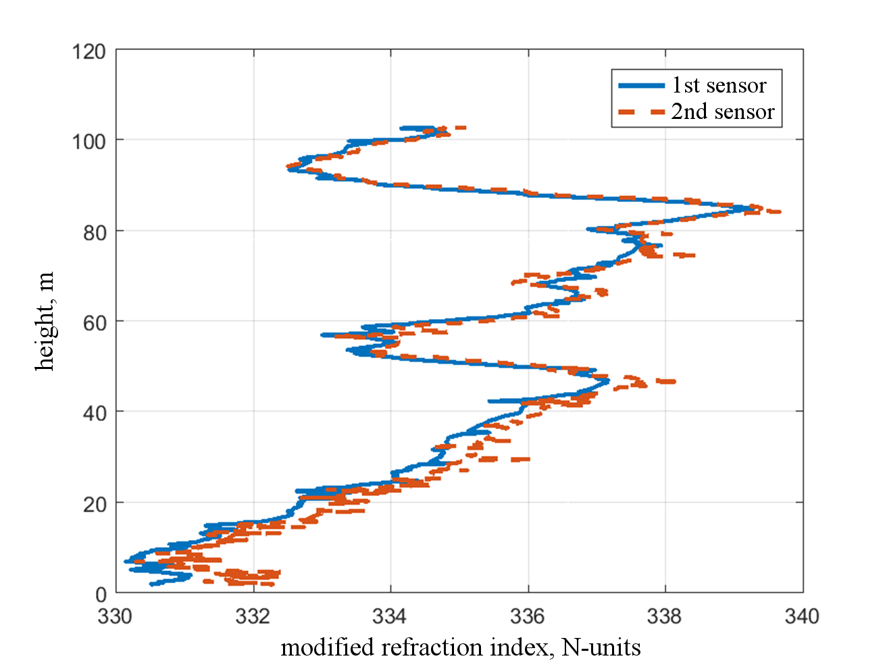
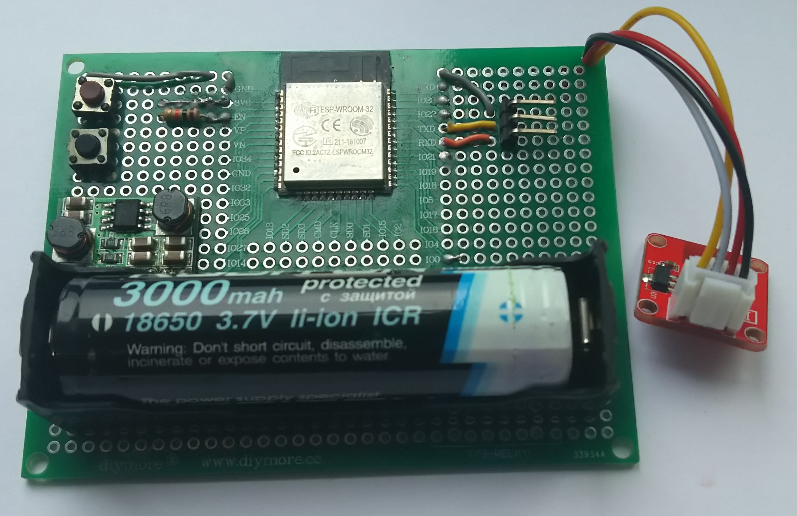
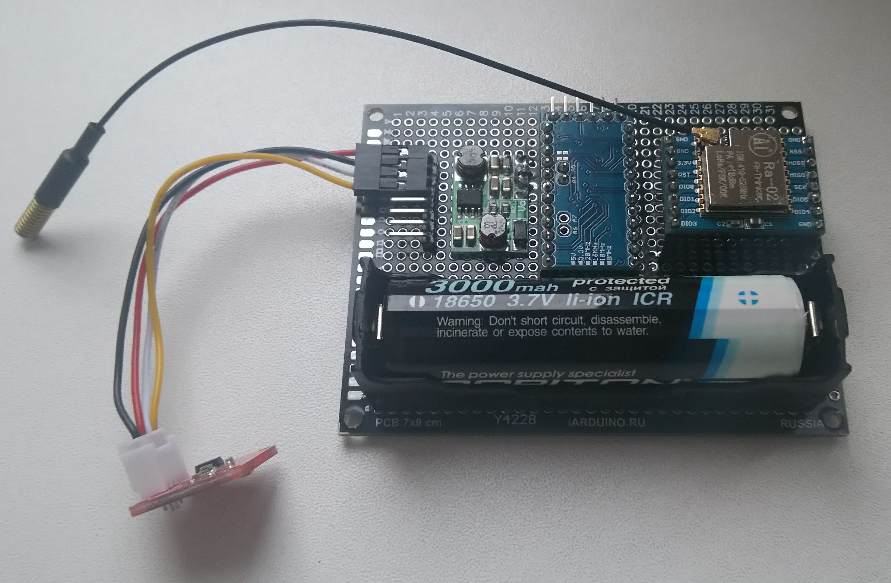
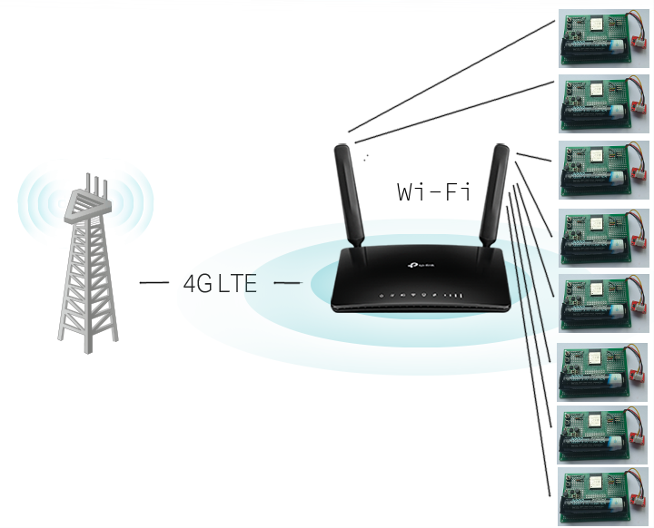

::: {custom-style="Author"}
M.S. Mikhailov  
Radio Devices and Antenna Systems Department  
National Research University "MPEI"  
Moscow, Russian Federation  
MikhailovMS@mpei.ru  
:::

::: {custom-style="Author"}
N.O. Strelkov  
Radio Technical Fundamentals Department  
National Research University "MPEI"  
Moscow, Russian Federation  
StrelkovNO@mpei.ru  
:::

::: {custom-style="abstract"}
***Abstract*** --- **In this paper we present a brief description of existing wireless data transmission technologies used in the Internet of Things (IoT) and the Internet of Industrial Things (IIoT). Then we consider the application of Wi-Fi and LoRa technologies for wireless measurement and monitoring of physical quantities (really they are the parameters of the evaporation duct – air temperature, humidity and atmospheric pressure). The system contains wireless sensing nodes (beacons) and the unit for host-centric processing and storage of data. We provide test results of a comparison of Wi-Fi- and LoRa-based implementations.**
:::

::: {custom-style="Keywords"}
***Keywords*** --- ***Internet of Things, Wireless LAN, remote sensing, wireless sensor network, radiowave propagation, atmosphere***.
:::

# Introduction

Currently, a lot of attention is paid to the development of wireless information collection systems with sensors and sensors. Such tasks arise in the power industry, meteorology, environmental care, logistics and transport, industry, healthcare, agriculture, construction, smart homes and cities and other areas. The readings from sensors can be collected and processed on local data acquisition and processing systems, as well as transmitted to the Internet server. In such case we are talking about IIoT. The main difference of the IIoT from the ordinary IoT are higher requirements for all elements of the system and, as a consequence, increased reliability.

<!-- System -->

It is absolutely expected that measuring system should operate in both fixed  and mobile modes. The latter requires that the device is lightweight and low-power. The main components of the system are smart wireless sensors (or beacons) and the processing module as shown on Fig. \@ref(fig:system).

::: {custom-style="figure caption"}
{width=6.7cm}
:::

To lower the design costs and to make system more universal we need to use identical internal structure of all beacons. This will allow us to extend the system without limits and to simplify beacon replacement on their failure. In the same time we need to lower the cost of each beacon to prevent financial losses on beacon breakage or its forfeit.

Currently there are a plenty number of commercial sensors for various physical quantities in the integrated design. Depending on the type of the measured parameter (or parameters), the sensor can have various forms of information representation. The simplest sensors output information in the form of analog signals. More advanced sensors provide information in the form of digital signals with a known data packet structure, and can also use specialized digital data transmission interfaces such as 1-Wire, CAN, I2C, SPI, TIA/EIA-232, TIA/EIA-422, Ethernet and others. For IIoT tasks, wireless data transmission from sensors is convenient. Every such a device should have the construction and design as shown in Fig. \@ref(fig:smart-sens).

<!-- Wireless sensor interface -->

Currently, there are a number of basis wireless interfaces for the IIoT: Bluetooth (with its Low Energy variant) [@bluetooth], LoRaWAN [@lora], Z-Wave [@zwave], ZigBee [@zigbee] and Wi-Fi [@wifi]. In common only a few radio modules are built as the system-on-chip (System-on-Chip), and this fact puzzles the design workflow because of the low-level programming. The Bluetooth interface itself is rather complicated technology, so it is difficult to perform programming and design of printed circuit boards for Bluetooth-capable SoCs. From the other hand if we choose design with two separate key elements - radio frequency transceiver and microcontroller (or microprocessor) chip we will get more flexible solution but need to use special measures to provide good autonomy of the device. In terms of battery life, two opposite implementations can be considered - based on Wi-Fi and Lora. In this case, the development of Wi-Fi-based device requires less time due to the presence of universal SoCs.

::: {custom-style="figure caption"}
{width=4.4cm}
:::

However, the quickly created such a Wi-Fi implementation is characterized by low battery life and a fairly small operating range of the system. Therefore, at present time and in practical development the LoRa [@lora] (short for long range) technology is very often used, which differs by efficient use of the radio frequency spectrum, a large operating range, low cost and low energy consumption from the power source. In addition, the advantage of the technology is the use of the license-free frequency band -- Industrial, Scientific and Medical (ISM).

In the next section, we will consider development of a data acquisition apparatus for obtaining physical quantities of atmosphere and computation of evaporation duct using two wireless data transfer technologies -- Wi-Fi and LoRa.

# Apparatus for obtaining the physical quantities of the evaporation duct

Study of radio propagation of the microwave range over-the-horizon is in full swing [@Piers], [@Nis]. This is usually needed for radar and radio communications tasks. The over-the-horizon propagation depends on the state of the troposphere.

To be precise, it is mostly due to the spatial distribution of the refractive index. The refractive index of the troposphere can be found by the empirical formula:

::: {custom-style="MTDisplayEquation"}
\begin{equation}
n = 1 + \frac{77.6}{T}\left( P+4810\frac{e}{T} \right) \cdot 10^6.
(\#eq:climate)
\end{equation}
:::

where $T$ is air temperature, measured in degree Kelvin, $e$ its humidity measured in percent and $p$ — atmospheric pressure in hPa. Such a concept as the «normal troposphere» is described by a change in pressure and temperature with height. With increasing altitude, the temperature decreases with speed 6.5 K/km. 

When air temperature is about 0 degree Celsius and the air pressure is about 1000 hectopascal, the pressure decreases with a speed of 1.25 kPa/m with increasing altitude. However, quite often inversion of meteorological parameters can occur in the troposphere.

Temperature inversion creates a surface or elevated ducts. Inversion of humidity — evaporation ducts, mist, brume and mirages (see Fig. \@ref(fig:fly)).

::: {custom-style="figure caption"}
{width=8cm}
:::

In tropical latitudes, the evaporation duct almost always appears, and its thickness may have up to 50 meters. In the temperate climate the likelihood appears to be 50 percent with thickness from 8 to 15 meters.

Measurement of such ducts is necessary to assess the maximum range of radio systems emitting beyond the horizon. The collection and processing of statistical data will increase the accuracy of the assessment. Measurements should be performed at several points spaced apart in vertical space with step about one meter.

Received refractive index data were found from experimental measurements of meteorological parameters using an unmanned aerial vehicle (Fig. \@ref(fig:UAV)). Both the evaporation ducts (Fig. \@ref(fig:Mas-evap)) and elevation duct (Fig. \@ref(fig:Mas-elev)) were measured. The elevation duct can be modeled by a piecewise linear model. Evaporative ducts are usually set using the Paules-Jeske model using the formula \@ref(eq:PJ):

::: {custom-style="MTDisplayEquation"}
\begin{equation}
M(h) = M(0) + 0.125 \left[ h-h_d \cdot \ln\frac{h+h_0}{h_0} \right]
(\#eq:PJ)
\end{equation}
:::

An alternative to this formula is the parabolic layer described by V. A. Fock according to the formula \@ref(eq:Fock):

::: {custom-style="MTDisplayEquation"}
\begin{equation}
M(h) = M(h_d) + \frac{10^6}{a}\frac{(h-h_d)^2}{h+l}.
(\#eq:Fock)
\end{equation}
:::

## Beacons construction

The manufacturers of semiconductor devices offer a plenty set of sensors for temperature, humidity and atmospheric pressure. Such devices may measure one parameter or multiple parameters in the same time. The most common are two-parameter sensors – they measure temperature and humidity. But some of these sensors are have low or unknown accuracy characteristics.

Currently only one vendor – Bosch Sensortec GmbH [@bhsc] have sensors for measurement of all 3 parameters in the same time. The models are BME280 [@bme280] and BME680 [@bme680]. The BME680 module is more advanced and differs from BME280 by existences of extra features – gas detection and air quality control. So the functionality of BME280 is enough for current project.

::: {custom-style="figure caption"}
{width=8cm}
:::

::: {custom-style="figure caption"}
{width=8cm}
:::

The BME280 module may be described by low power consumption and high accuracy [@bme280]. It has two digital interfaces – I2C and SPI buses. We use I2C because of the ability to obtain data on long distances and ease of multiplexing for multiple I2C sensors connected to one beacon.

We have developed two prototypes of wireless measurement modules: using Wi-Fi technology based on the Espressif Systems processor module [@espressif] and using LoRa technology based on the HopeRF RFM98 transceiver [@rfm] and ATMega328 microcontroller [@atmega328].

Both prototypes use standard protected Lithium-Ion rechargeable battery pack with standard. Each device has step-up and step-down DC-DC module to provide stabilized 3.3 V supply voltage independently on battery discharge level. This measure allows us to use the battery charge as efficiently as possible. Each device measures and sends data once a minute then it is programmed to enter deep sleep state.
Let's examine each of the prototypes in more detail. The Wi-Fi based is shown on Fig. \@ref(fig:sens-photo-wi-fi), while Lo-Ra based is shown on Fig. \@ref(fig:sens-photo-lora). 

::: {custom-style="figure caption"}
{width=8cm}
:::

::: {custom-style="figure caption"}
{width=7.8cm}
:::

The Wi-Fi based prototype consumes 150 mA during measurement of environmental parameters and sending them via radio interface. Then it goes to sleep with current about 70 uA. Rechargeable battery discharge will last longer in the case of more rarely sending data.

The LoRa based prototype has lower power consumption: it consumes 25 mA when transmitting data and 5 uA in sleep mode. As was noted above such parameters are achieved using the same battery and DC-DC converter.

We have described the design of Wi-Fi and LoRa-based beacons. Then we need to discuss the structure and design of processing module for receiving and collecting data from sensors.

## Unit for host-centric processing and storage of data

In the case of using the Wi-Fi standard, the host-centric data processing and storage unit maybe constructed as a radio gateway with special internal software, with data storage and a 3G/4G modem connected to it via a USB or serial interface. 

The gateway is configured and acts as DHCP (to assign IP address), NTP (to set time on beacons), and HTTP server (for data receive using GET or POST method). The resulting implementation is shown schematically on Fig. \@ref(fig:router-wi-fi).

Wireless security is assured by using of Wi-Fi Protected Access II (WPA2) encryption. The system operates as follows:

::: {custom-style="figure caption"}
{width=7.8cm}
:::

::: {custom-style="figure caption"}
{width=7.8cm}
:::

after power on, the wireless router establishes mobile data network connection by using integrated cellular modem and synchronizes its clock with the defined NTP server. Then it mounts partition from USB flash drive. After that it is ready to serve and  waits for connection(s) from beacons. Beacons connect to the router in regular time intervals, obtain IP address and date from it and send the measured environmental parameters to it.

The router stores data on USB flash drive and/or sends it to Internet server for analysis and visualization. Our experiments showed the following results: such a system works at a distance of up to 150 meters in urban conditions without the use of radio amplifiers and directional antennas.

The specifics of the LoRa implementation is that instead of a Wi-Fi router, one should use a specialized LoRa-3G/4G gateway with the appropriate software or firmware. In this case, the essential difference of such a system will be its range. In addition, the autonomy of the beacons is better than in the case of Wi-Fi. For LoRa system we have the following results: the system is operating in the distance up to 1.5 km in urban area. We have summarized the obtained results in Table. \@ref(tab:tab-comp).

Currently, we are going to connect several sensors to one module with a microcontroller and a LoRa radio frequency transceiver. This will reduce power consumption and simplify the scheme of building the device.

We are also developing server software to calculate the dependence of the refractive index on the values measured by climatic sensors parameters.

Table: (\#tab:tab-comp) Comparison of sensor systems

| **Parameter** | **Prototype** | ←←← |
|:--------------|:-------------:|:----:|
| ↑↑↑           | **Wi-Fi**         | **LoRa **|
| Maximal supply current, mA | 150 | 25 |
| Minimal supply current during sleep, uA | 70 | 5 |
| Operating range, m | 150 | 1500 |
| Battery life | 10 days | 60 days |

# Conclusion {-#conclusion}

In the present work, we have depicted general structure of wireless data collection systems in general form and presented two prototypes for implementing a vertically spaced IIoT autonomous data acquisition, computation and forecasting of the appearance of the evaporation duct in the lower atmosphere. We have shown that usage of LoRa technology is more effective in terms of power consumption and range, than our previous Wi-Fi-based implementation [@inf18]. In the future, it is better to increase the number of sensors in height, which would measure not only the evaporation duct [@duct18].

##### Acknowledgment {-#acknowledge}

This work was supported by the Ministry of Education and Science of the Russian Federation (project № 8.9598.2017/BCh).

##### References {-#references}

